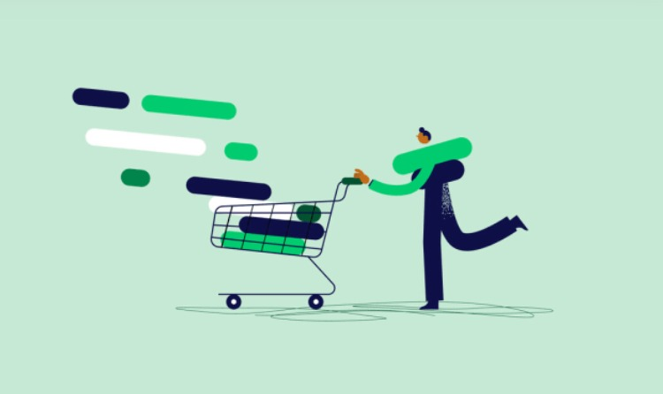

## Project Introduction

Welcome to my retail analytics project. My goal is to understand this customers better by analyzing their purchasing behavior and satisfaction levels. By doing so, i aim to adapt business strategies and improve the overall shopping experience for the customers.

## Objective.

I am diving into the dataset, which includes so much information but i am mainly focusing on gender, age, purchase frequency, and shopping satisfaction. Through this analysis, i will uncover insights in three main areas: 

### Purchase Frequency by Gender: 
I will explore how often different genders make purchases, helping us tailor our marketing efforts to specific customer segments.
### Age Distribution:
 I will examine the distribution of customers across age groups, providing valuable insights into the customer demographics.
### Shopping Satisfaction Levels: 
I will analyze satisfaction levels among the customers, identifying areas for improvement to enhance overall satisfaction and loyalty.

## Recommendations.

I realized that the female gender tends to shop more than the male gender and in order to increase  male shoppers i have made the following recommendatons:
1. Provide special discounts or offers designed specifically for male shoppers to make them feel valued and encourage them to shop more frequently.
2. Make it simple and quick for them to find what they want and complete their purchases online. This includes improving website navigation and making the checkout process hassle-free.
3.  Send them personalized emails or notifications about products they might like or promotions that are relevant to them.
4. Create online groups where male customers can connect with each other, share tips, and discuss their favorite products. This sense of community can encourage them to shop more often.

In my findings, i observed that customers aged 21-25 tend to shop more frequently, while those aged 66-70 shop less. There's an opportunity to boost shopping activity among the 30-55 age group. This includes:
1. Tailor marketing efforts to the interests and preferences of the 30-55 age group. Highlight products and promotions that resonate with their lifestyles and needs.
2. Create engaging content, such as blog posts, social media content, and videos, that appeals to the interests and concerns of the 30-55 age group. This can help build rapport and encourage them to explore more products.

My analysis indicates that customer satisfaction levels are currently at a mid-level, indicating room for improvement. While not at an optimal level, this presents an opportunity for us to enhance the customer experience and raise satisfaction levels across the board.

## Conclusion.

By analyzing purchase frequency, age distribution, and satisfaction levels, i haved gained actionable insights to guide business decisions and improve customer experience. My goal is to deliver exceptional service and build lasting relationships with customers.